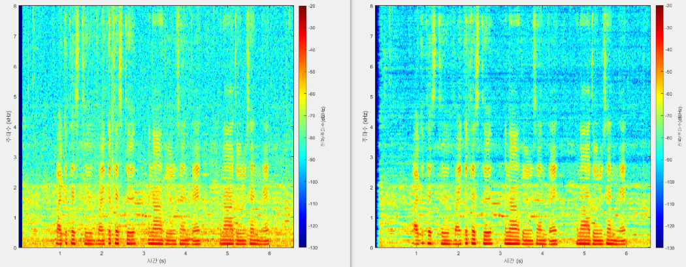

# RT_AuxIVA_mask_Online

---

# Target Speech Extraction

서강대 전자공학과 박현민 교수님 연구실에서 제작한 octa capture microphone을 사용한 실시간 입출력 처리 모듈이며, 타겟 화자가 배경 잡음 속에서 발화하는 다채널 음원 신호를 입력으로 해당 알고리즘이 예측하여 잡음이 억제된 타겟 화자 추출 결과를 실시간 line-out 출력 및 std out 혹은 wav파일을 반환 합니다.

## **독립성분분석 (Independent Vector Analysis, IVA)**

여러 독립적인 신호가 뒤섞인 음원에 대해서 각 출력 채널이 최대한 독립적인 신호로 구성되도록 분리하는 알고리즘입니다. 이를 통해 노이즈와 타겟 음원을 서로 분리하여 타겟 음원을 추출할 수 있습니다.

## Prerequisite

이는 옥타 캡처 보드 입력을 기반으로 제작된 코드로 이를 위해서는 옥타 캡처 보드 입력과 이에 맞는 소프트웨어가 설치되어야 합니다.

[The RtAudio Home Page](https://www.music.mcgill.ca/~gary/rtaudio/)

## Setting Parameter in AUXIVA_mask_Online.h

```cpp
#define Nch			3
#define nWin		2048
#define BufferSize		512
#define SamplingFreq    16000
```

- `Nch` 은 설정하고자 하는 입력 마이크의 개수를 의미합니다.
- `nWin` 은 short time fourier transform(STFT) 에서 매 프레임 fast fourier transform(FFT)를 진행하기 위한 윈도우 샘플의 개수를 의미합니다. 이는 2의 거듭제곱 수로 설정하며 일반적으로 512~4096내에서 tuning을 진행할 수 있습니다.
- `BufferSize` 는 매 프레임 새로 들어오는 샘플의 개수를 말하며, 매 프레임은 전체 윈도우 샘플의 1/4간격으로 움직이기 때문에 nWin의 1/4값으로 설정 해줍니다.
- `SamplingFreq` 는 입력할 wav 파일의 샘플링 주파수로 설정 해줍니다.

## Setting Option in ProcBuffers.h

```cpp
#define MAKE_FILE		1			//option 1 : wav 저장 (IVA출력 + 입력원본)		2: strout 출력(IVA출력)		3: strout 출력 (IVA출력 + 입력 원본)
#define SAVE_OPT		2			//option 1 : Target Output만 저장				2: Target 과 Noise Output 모두 저장
```

- `MAKE_FILE`  line-out외에도 추가적으로 wav를 저장할지, 커맨드라인으로 출력할지를 선택하는 옵션입니다.
- `SAVE_OPT` wav 저장시, Target 출력만 저장할지, 혹은 Noise도 모두 저장할지를 선택하는 옵션입니다.

## Microphone Configuration in ProcBuffers.cpp

```cpp
...
ProcBuffers::ProcBuffers()
{
...
	// mic_array[ch][0] = mic_array[0]과의 상대적인 x좌표입력
	// mic_array[ch][1] = mic_array[0]과의 상대적인 y좌표입력
	// mic_array[ch][2] = mic_array[0]과의 상대적인 z좌표입력
	mic_array[0][0] = 0;
	mic_array[0][1] = 0;
	mic_array[0][2] = 0;
	mic_array[1][0] = 0;
	mic_array[1][1] = 0;
	mic_array[1][2] = 0.2;
	mic_array[2][0] = 0;
	mic_array[2][1] = 0;
	mic_array[2][2] = -0.2;
...
```

마이크의 위치 배열을 설정합니다. 이는 각 마이크 간의 거리를 계산하기 위해서 필요한 것으로 어떤 것을 기준으로 잡고 설정해도 무관합니다.

## Build

x64로 빌드를 진행합니다.

## Execution

### **BSS API**

wav 저장 시에, 입력 및 출력 파일은 각각 input과 output 폴더 내부에 저장됩니다. **input, output 디렉토리가 없으면 오류가 발생합니다.**

프로그램을 실행한 후,

- 처리 프로그램의 시작을 위해서는 키보드의 a키를 누릅니다.
- 처리 프로그램의 중단을 위해서는 키보드에 s키를 누릅니다.
- 처리 프로그램의 종료를 위해서는 키보드의 d키를 누릅니다.


만약 wav저장 옵션으로 실행하였다면, 위와 같이 처리 중임을 안내하는 문구가 출력됩니다.

- **입력 및 출력 스펙트로그램 예시**

3채널, 마이크 간격 20cm, 


